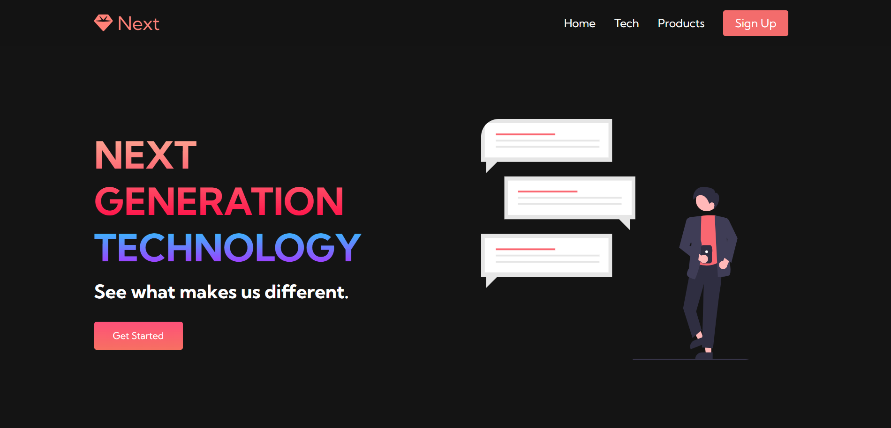
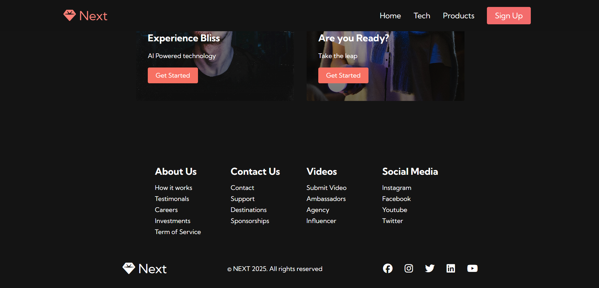

# Next Website

## Overview

**Next Website** is a responsive, modern multi-page web project featuring a sleek navbar, hero sections, services overview, and footer with social media links. It is designed with mobile-friendly navigation and clean UI aesthetics powered by custom CSS and FontAwesome icons.

---

## Features

* **Responsive Navbar** with mobile menu toggle (hamburger menu)
* **Hero Sections** showcasing content with heading, description, call-to-action buttons, and images
* **Services Section** highlighting key features with interactive buttons
* **Footer** containing multiple informational and social media links
* Uses **Google Fonts (Kumbh Sans)** for modern typography
* Includes **FontAwesome** for icons and social media logos
* Mobile menu toggle functionality implemented with JavaScript

---

## Project Structure

* `index.html` — Main homepage with hero section and services
* `tech.html` — Technology page with similar layout but different content and image
* `styles.css` — All styling rules including layout, typography, colors, and responsiveness
* `app.js` — JavaScript for mobile menu toggle interaction
* `images/` — Contains image assets used in the hero sections (`pic1.svg`, `pic2.jpg`)

---

## Technologies Used

* HTML5
* CSS3 (Flexbox, gradients, responsive design)
* JavaScript (Vanilla JS for menu toggle)
* Google Fonts (Kumbh Sans)
* FontAwesome icons

---

## How to Use

1. Clone or download the repository.
2. Open `index.html` or `tech.html` in your preferred browser.
3. Resize the window or open on a mobile device to see the responsive navbar with toggle functionality.
4. Customize text, images, and links as needed.

---

## Notes

* The favicon uses an inline SVG with a gem emoji for a unique touch.
* The site uses smooth gradients and modern font clipping techniques for the logo.
* The pages have placeholder links (`href="/"`) which you can update to navigate to your actual URLs or routes.
* The CSS and HTML files are organized for easy customization and scaling.

---

## Acknowledgments

This project is based on the tutorial by Brian Design.  
Special thanks to Brian for his clear and helpful guidance.  
You can find his work here:  
- YouTube: [https://www.youtube.com/@briandesign](https://www.youtube.com/@briandesign)  
- Twitter: [https://twitter.com/briandesignz](https://twitter.com/briandesignz)

---

## Screenshots

### Home Page
 

### Footer Section

